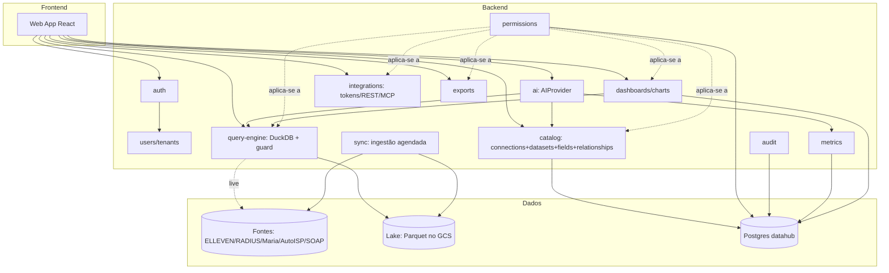

# Data Hub Sebratel — Arquitetura do MVP

> **Status:** proposta para aprovação (nenhuma linha de código escrita ainda).
> **Origem:** reaproveita conectores, credenciais (`.env`) e padrões do `churn_mvp`.
> **Princípio central pedido:** o hub é um **centralizador/lakehouse com conectores** — as
> queries de ingestão são **generalistas** (pouco tratamento); a semântica de negócio vive
> no **catálogo** (datasets, campos amigáveis, métricas), nunca no SQL de extração.

---

## 1. Visão geral da arquitetura

Três camadas independentes:

```
┌────────────────────────────────────────────────────────────────────┐
│ EXPERIÊNCIA          Web App (React) · Chat IA · Integrações (BI)  │
├────────────────────────────────────────────────────────────────────┤
│ NÚCLEO (Data Hub)    API REST · Catálogo · Motor de Consulta ·     │
│                      Métricas · Permissões · Auditoria · Cache     │
├────────────────────────────────────────────────────────────────────┤
│ CONECTORES           ELLEVEN (PG) · RADIUS (PG) · Massivas (Maria) │
│  (somente leitura)   AutoISP (PG) · SOAP RH · Bucket GCP           │
└────────────────────────────────────────────────────────────────────┘
```

Fluxo de dados (modo lakehouse):

1. **Conectores** — um driver por fonte, idêntico ao padrão do churn_mvp
   (`makePool()` lendo `DB_<FONTE>_*` do `.env`). Todos com usuário/guard
   **somente-leitura**.
2. **Ingestão generalista** — para cada dataset publicado, uma query simples e ampla
   (`SELECT <colunas> FROM <tabela/view> [WHERE incremental]`), sem regra de negócio.
   Materializada em **Parquet no bucket GCP** (`BUCKET_GCP_NAME`) particionado por
   dataset/data — este é o "lake".
3. **Motor de consulta** — **DuckDB** embutido no backend lê os Parquet do lake e
   responde filtros/agregações/joins declarados pelo usuário. Consultas "ao vivo"
   direto na fonte ficam disponíveis como opção por dataset (flag `live`).
4. **Catálogo (Postgres do hub)** — metadados: datasets amigáveis, campos, descrições,
   relacionamentos, métricas, dashboards, permissões, tokens, auditoria. O usuário
   final **nunca vê** schema/tabela física.

Decisões-chave (e porquê):

| Decisão | Escolha MVP | Racional |
|---|---|---|
| Lake | Parquet no GCS + DuckDB | Barato, sem novo servidor, consultas analíticas rápidas, encaixa no bucket que já existe no `.env` |
| Banco do hub | PostgreSQL (novo database, ex.: `datahub`) | Já dominado pela equipe; guarda só metadados |
| Backend | Node + TypeScript, Express modular (mesma família do churn_mvp) | Time já opera esse stack em Portainer/docker-compose; NestJS fica para a v1.0 se o time crescer |
| Frontend | React + Vite + TS + Tailwind + shadcn/ui + Zustand | Reuso direto de login Google, UI kit e padrões do churn_mvp |
| Filas/agendas | Scheduler próprio (padrão `etl-scheduler.mjs`) no MVP; BullMQ+Redis na v1.0 | Evita Redis no MVP; a carga inicial é 1 tenant |
| Segurança SQL | Guard read-only (porta o `guard.mjs`) + usuários de banco somente-SELECT | Defesa em profundidade já validada no churn_mvp |

> **Ponto de aprovação A** — Express modular (recomendado) vs. NestJS desde o MVP.
> **Ponto de aprovação B** — Lake em Parquet/GCS+DuckDB (recomendado) vs. materializar tudo no Postgres do hub.

---

## 2. Casos de uso

| # | Ator | Caso de uso |
|---|---|---|
| UC1 | Usuário | Autenticar (Google OAuth do domínio; e-mail/senha para clientes externos na v1.0) |
| UC2 | Usuário | Ver página inicial: dashboards recentes, favoritos, consultas recentes, sugestões da IA |
| UC3 | Usuário | Navegar no catálogo de **Conjuntos de Dados** (nome amigável, descrição, tags, dono, atualização, nº de registros) |
| UC4 | Usuário | Explorar um conjunto (grade tipo Airtable): filtrar, ordenar, agrupar, buscar, paginar, ocultar colunas |
| UC5 | Usuário | Salvar visualização; exportar CSV/Excel; compartilhar visualização |
| UC6 | Usuário | Criar dashboard drag-and-drop com gráficos/KPIs/tabelas |
| UC7 | Usuário | Usar métricas da biblioteca (Receita, Churn, Ticket Médio…) em gráficos |
| UC8 | Usuário | Conversar com a IA: perguntar em linguagem natural → gráfico/tabela/explicação |
| UC9 | Usuário | Compartilhar dashboard/conjunto/consulta com papéis (ver/editar/exportar/administrar) |
| UC10 | Usuário | Gerar credenciais de integração (Power BI, Sheets, API REST, MCP) |
| UC11 | Admin | Cadastrar conexões (fontes), mapear tabelas → datasets, descrever campos, ocultar/sensibilizar campos, criar campos calculados |
| UC12 | Admin | Definir relacionamentos entre datasets e agendar sincronização |
| UC13 | Admin | Gerenciar usuários, papéis, permissões e auditoria |
| UC14 | Sistema | Sincronizar datasets (full/incremental) para o lake conforme agenda |

---

## 3. Fluxos do usuário

**F1 — Primeiro acesso**
Login Google → home com onboarding ("explore os conjuntos publicados") → catálogo → abre "Clientes" → explora na grade → favorita.

**F2 — Pergunta à IA**
Home → chat → "faturamento por mês em 2026" → IA localiza dataset `Financeiro` → monta consulta estruturada (JSON, não SQL) → motor executa no lake → gráfico de linha + explicação → botão "adicionar ao dashboard".

**F3 — Criação de dashboard**
Dashboards → novo → arrasta componente "barras" → escolhe dataset/métrica/dimensão → filtros globais do dashboard → salva → compartilha com equipe (visualizar).

**F4 — Publicação de um dataset (admin)**
Admin → Conexões → escolhe ELLEVEN → lista tabelas/views físicas → seleciona `contracts` → nomeia "Contratos", descreve, oculta campos técnicos, marca `cpf` como sensível → define chave incremental (`updated_at`) e agenda diária → publica → aparece no catálogo.

**F5 — Integração externa**
Integrações → "Power BI" → gera token + URL → documentação e exemplo prontos → cliente conecta via web connector/OData.

---

## 4. Modelo de domínio

Conceitos e relações (o usuário só enxerga os em **negrito**):

- Tenant 1—N User; User N—N Role.
- Tenant 1—N Connection (fonte física) 1—N PhysicalObject (tabela/view descoberta).
- PhysicalObject 1—1 **Dataset** (publicação amigável) 1—N **Field**.
- **Dataset** N—N **Dataset** via **Relationship** (semântico: "Contratos pertencem a Clientes").
- **Dataset** 1—N SyncRun (execuções de ingestão) e 1—N **SavedView**.
- **Metric** referencia 1 Dataset + expressão de agregação; reutilizada em Widgets.
- **Dashboard** 1—N **Widget** (tipo de gráfico + consulta estruturada).
- **Conversation** 1—N Message (chat IA; mensagens guardam a consulta gerada).
- Grant liga (User|Role) × (Dataset|Dashboard|SavedView|Metric) × nível.
- ApiCredential (token de integração) × escopos (datasets, ações).
- AuditLog registra tudo; ExportJob registra exportações.

---

## 5. Entidades (esboço dos campos principais)

Todas as tabelas do hub têm `tenant_id`, `created_at`, `updated_at`.

- **tenants**: id, name, slug, status.
- **users**: id, email, name, avatar, auth_provider (`google`), last_login.
- **roles**: id, name (`admin`, `editor`, `viewer`), builtin. **user_roles**: user_id, role_id.
- **connections**: id, name, kind (`postgres|mysql|soap|gcs`), env_prefix (ex.: `DB_ELLEVEN`), status, last_check_at. *Credenciais ficam no `.env`/secret store — nunca no banco.*
- **physical_objects**: id, connection_id, schema_name, object_name, kind, row_estimate, discovered_at.
- **datasets**: id, physical_object_id, name, slug, description, owner_id, tags[], visibility, sync_mode (`snapshot|incremental|live`), incremental_key, schedule_cron, row_count, last_sync_at, faq (jsonb), docs (markdown).
- **fields**: id, dataset_id, source_column, label, description, type (`text|number|date|bool|json`), hidden, sensitive, format, calc_expression (campos calculados), sort_order.
- **relationships**: id, from_dataset_id, from_field_id, to_dataset_id, to_field_id, cardinality, label.
- **metrics**: id, name, slug, description, dataset_id, expression (jsonb: agregação+filtros), format, owner_id.
- **saved_views**: id, dataset_id, name, definition (jsonb: filtros/ordem/grupos/colunas), owner_id, shared.
- **dashboards**: id, name, description, layout (jsonb grid), owner_id, favorite_count.
- **widgets**: id, dashboard_id, type (`line|bar|pie|area|funnel|kpi|gauge|table|heatmap|map`), query (jsonb estruturado), viz_options (jsonb), position.
- **conversations** / **messages**: chat IA; message guarda `role`, `content`, `generated_query` (jsonb), `result_ref`.
- **grants**: id, subject_type (`user|role`), subject_id, resource_type, resource_id, level (`view|edit|export|admin`).
- **api_credentials**: id, name, token_hash, scopes (jsonb), last_used_at, expires_at, revoked.
- **sync_runs**: id, dataset_id, mode, started_at, finished_at, rows, bytes, status, error.
- **audit_logs**: id, user_id, action, resource_type, resource_id, detail (jsonb), ip.
- **export_jobs**: id, user_id, dataset_id/view_id, format (`csv|xlsx`), status, file_ref.

---

## 6. Diagrama de módulos



Regras: `ai` só conversa com o resto via interfaces (`AIProvider`, `QueryService`,
`CatalogService`) — trocável entre OpenAI/Anthropic/Google/Ollama por configuração.
Nenhum módulo importa outro diretamente; tudo passa por contratos em `core/`.

---

## 7. Estrutura de pastas (monorepo)

```
lakehouse_sebratel/
├── docs/                     # este documento e próximos
├── .env                      # credenciais (já existe; mesmo formato do churn_mvp)
├── docker-compose.yml        # web + api + sync + postgres(datahub)
├── apps/
│   ├── web/                  # React+Vite+TS+Tailwind+shadcn (padrões do churn_mvp)
│   │   └── src/{features,components,store,lib,router}/
│   └── api/                  # Node+TS, Express modular
│       └── src/
│           ├── core/         # contratos, erros, config, di leve
│           ├── modules/
│           │   ├── auth/  users/  tenants/
│           │   ├── catalog/      # connections, datasets, fields, relationships
│           │   ├── query/        # motor DuckDB, query JSON→SQL, guard
│           │   ├── metrics/  dashboards/
│           │   ├── ai/           # AIProvider + providers/{anthropic,openai,google,ollama}
│           │   ├── integrations/ permissions/ exports/ audit/
│           │   └── sync/         # ingestão generalista + scheduler
│           └── connectors/   # makePool por fonte (portado do churn_mvp) + soap + gcs
└── packages/
    └── shared/               # tipos TS compartilhados (QueryDef, DatasetMeta, ChartSpec)
```

---

## 8. APIs (REST, prefixo `/api/v1`)

| Método/rota | Descrição |
|---|---|
| `POST /auth/google` · `POST /auth/refresh` | Login (padrão churn_mvp) e refresh JWT |
| `GET /home` | Recentes, favoritos, sugestões IA |
| `GET /datasets` · `GET /datasets/:slug` | Catálogo e detalhe (campos, relacionamentos, docs, FAQ) |
| `POST /datasets/:slug/query` | **Endpoint central**: recebe `QueryDef` (jsonb) → resultado paginado |
| `GET/POST/PATCH /views` | Visualizações salvas |
| `POST /exports` · `GET /exports/:id` | Exportação CSV/Excel assíncrona |
| `GET/POST/PATCH/DELETE /dashboards` (+ `/widgets`) | Dashboards |
| `GET/POST /metrics` | Biblioteca de métricas |
| `POST /ai/conversations/:id/messages` | Chat IA (SSE/stream) |
| `POST /shares` · `GET /shares` | Grants de compartilhamento |
| `GET/POST/DELETE /credentials` | Tokens de integração |
| `GET /integrations/:kind/docs` | Doc/exemplo gerado por integração |
| **Admin:** `GET/POST /connections`, `GET /connections/:id/objects` (descoberta), `POST /datasets` (publicar), `POST /datasets/:id/sync` | Administração do catálogo |
| `GET /audit` | Auditoria (admin) |

`QueryDef` (o contrato que substitui SQL para usuários e IA):

```json
{
  "dataset": "contratos",
  "select": ["cidade", { "metric": "receita" }],
  "filters": [{ "field": "status", "op": "!=", "value": "Cancelado" }],
  "groupBy": ["cidade"],
  "orderBy": [{ "field": "receita", "dir": "desc" }],
  "limit": 100
}
```

O backend compila `QueryDef` → SQL DuckDB (ou SQL da fonte, se `live`), sempre passando
pelo guard read-only e pelos filtros de permissão/campos sensíveis.

---

## 9. Banco de dados

- **`datahub` (PostgreSQL novo)** — todas as entidades da seção 5. Migrations SQL
  versionadas (ou Prisma, se aprovado NestJS/Prisma). Índices por `tenant_id` em tudo.
- **Lake (GCS)** — layout: `gs://<bucket>/datahub/<tenant>/<dataset>/dt=<YYYY-MM-DD>/part-*.parquet`
  + `_manifest.json` (schema, row_count, watermark incremental).
- **Fontes** — intocadas, acesso somente leitura. A ingestão usa queries generalistas
  registradas por dataset (padrão registry+overrides do churn_mvp, editável por admins
  com guard).

---

### 9.1 Controle de carga na ingestão (aprovado em 12/07/2026)

Premissa: **serão muitos dados e as fontes são bancos de produção** — a ingestão nunca
pode sobrecarregá-los. Regras do módulo `sync` (evolução da lógica do churn_mvp):

1. **Fontes tocadas no máximo 1x/dia por dataset**, em janela de madrugada
   (`ETL_HOUR`, padrão 3h) — mesmo padrão do `etl-scheduler.mjs`. Usuários, dashboards
   e IA consultam SEMPRE o lake (Parquet/DuckDB), nunca a fonte.
2. **Incremental por watermark**: datasets com `incremental_key` (ex.: `updated_at`,
   `id`) só buscam `WHERE key > <último watermark>` — o full acontece uma única vez,
   na publicação.
3. **Leitura em lotes por keyset** (`WHERE id > $last ORDER BY id LIMIT 50000`), com
   pausa configurável entre lotes (`SYNC_BATCH_PAUSE_MS`) — nunca um `SELECT` gigante
   sem limite segurando a conexão.
4. **Concorrência 1 por conexão** (fila sequencial): dois datasets da mesma fonte
   nunca sincronizam ao mesmo tempo; `connectionLimit`/pool pequeno (≤ 3).
5. **Timeouts e desistência educada**: `statement_timeout` de 120 s (herdado do
   churn_mvp), retry com backoff e abort — um sync que falha não derruba os demais.
6. **Usuário de banco somente-SELECT** + guard read-only em toda query registrada.
7. Métricas de cada `sync_run` (duração, linhas, bytes) ficam gravadas — dá para ver
   custo por dataset e reagendar/quebrar o que pesar.

## 10. Modelo de permissões

- **Papéis** (por tenant): `admin` (tudo), `editor` (cria dashboards/métricas/views), `viewer`.
- **Grants por recurso** (sobrepõem o papel): níveis `view < edit < export < admin`,
  aplicáveis a dataset, dashboard, view e métrica, para usuário ou papel.
- **Campo sensível**: mascarado (`***`) para quem não tem `export` no dataset; campo
  `hidden` nunca sai da API.
- **Enforcement num ponto único**: middleware de permissão + injeção de filtros no
  compilador de `QueryDef` (nunca no frontend).
- Toda ação de leitura/escrita relevante gera `audit_log`.

---

## 11. Estratégia multi-tenant

- MVP: **single-database, shared-schema** com `tenant_id` em todas as tabelas +
  **Postgres RLS** ativado desde o dia 1 (política por `current_setting('app.tenant_id')`).
- Lake segregado por prefixo `<tenant>/` no bucket; tokens de integração carregam o tenant.
- Conexões (fontes) pertencem ao tenant — prontos para, na v1.0, clientes plugarem
  as próprias fontes.
- Escala futura (Enterprise): promover tenants grandes para schema/banco dedicado sem
  mudar aplicação (o acesso já passa por repositórios com `tenant_id`).

---

## 12. Estratégia de IA

- Interface única:

```ts
interface AIProvider {
  chat(messages: Msg[], tools: ToolDef[], opts): AsyncIterable<Delta>
}
// implementações: AnthropicProvider (default), OpenAIProvider, GoogleProvider, OllamaProvider
```

- **A IA nunca escreve SQL.** Ela usa ferramentas (tool use):
  1. `search_datasets(question)` → catálogo com descrições/FAQ (por isso o catálogo rico importa);
  2. `get_dataset_schema(slug)` → campos amigáveis + métricas disponíveis;
  3. `run_query(QueryDef)` → executa via o MESMO endpoint/permissões do usuário;
  4. `render_chart(ChartSpec)` → especificação de gráfico para o frontend;
  5. `save_dashboard(...)` (com confirmação do usuário).
- Segurança: as tools rodam com o token do usuário → a IA só vê o que ele pode ver.
- Respostas sempre com: resultado + explicação em linguagem natural + sugestão de próxima análise.
- Custo/latência: cache de respostas do catálogo; modelo configurável por tenant.

---

## 13. Estratégia de integração

Cada credencial gera automaticamente endpoint + token + doc + exemplo:

| Integração | Mecanismo MVP |
|---|---|
| API REST | `GET /public/v1/datasets/:slug/rows?token=…` (paginado, JSON) |
| Excel / Google Sheets | Mesmo endpoint em CSV (`Accept: text/csv`) — Sheets via `IMPORTDATA`/Apps Script |
| Power BI / Looker | Endpoint JSON paginado (Web connector) no MVP; OData na v1.0 |
| MCP | Servidor MCP expondo `search_datasets`, `get_schema`, `run_query` — mesmo contrato das tools da IA |

Tokens: hash no banco, escopo por dataset+ação, expiração e revogação; todo uso auditado.

---

## 14. Roadmap do MVP (≈ 6 sprints)

1. **S1 — Fundação**: monorepo, docker-compose (web/api/postgres), auth Google, tenants/roles, layout base (sidebar, tema claro/escuro).
2. **S2 — Conectores + Catálogo admin**: porte dos conectores do churn_mvp, descoberta de tabelas, publicação de datasets (nome/descrição/campos/ocultos/sensíveis).
3. **S3 — Sync + Lake + Motor**: ingestão generalista → Parquet/GCS, scheduler, DuckDB, compilador `QueryDef`→SQL com guard e permissões.
4. **S4 — Explorador**: grade estilo Airtable (filtros, ordenação, grupos, busca, paginação, ocultar colunas), views salvas, export CSV/Excel.
5. **S5 — Dashboards + Métricas**: biblioteca de métricas, editor drag-and-drop, 6 tipos de gráfico (linha, barras, pizza, área, KPI, tabela), home.
6. **S6 — IA + Compartilhamento + Integrações**: chat com tools, grants, tokens REST/CSV, auditoria, polimento.

**Fora do MVP** (consciente): SSO, mapas/heatmap/funil/gauge, OData, BullMQ/Redis, e-mail/notificações, campos calculados avançados.

## 15. Roadmap v1.0

- NestJS/Prisma (se aprovado) ou consolidação do Express; BullMQ + Redis para sync e exports.
- Todos os tipos de gráfico (mapa, heatmap, funil, gauge); filtros globais avançados.
- OData para Power BI/Looker; Google Sheets add-on; webhooks.
- Clientes externos: login e-mail/senha + convites; onboarding de fontes do próprio cliente.
- IA: dashboards gerados por completo, análises agendadas ("me avise se churn subir"), embeddings do catálogo para busca semântica.
- Notificações, comentários em dashboards, versionamento de views.

## 16. Roadmap Enterprise

- SSO (SAML/OIDC), SCIM, MFA.
- Tenants em schema/banco dedicado; réplicas de leitura; cache Redis de resultados.
- Row-level security por dados (ex.: vendedor só vê seus clientes) via políticas no catálogo.
- Data lineage, qualidade de dados (testes por dataset), SLA de atualização.
- Marketplace de conectores (APIs externas, arquivos, webhooks de entrada).
- Deploy multi-região, DR, retenção/anonimização LGPD automatizada.

---

## Pontos que precisam da sua aprovação

- **A.** Backend: Express modular em TS (recomendado, alinhado ao time) ou NestJS+Prisma desde já?
- **B.** Lake: Parquet no GCS + DuckDB (recomendado) ou materializar no Postgres do hub?
- **C.** Ordem dos sprints do MVP está aderente à sua prioridade? (IA está no S6; posso antecipá-la trocando com S4/S5 se for o diferencial de venda.)
- **D.** Provider de IA default: Anthropic (recomendado) — confirmar orçamento/chave.
